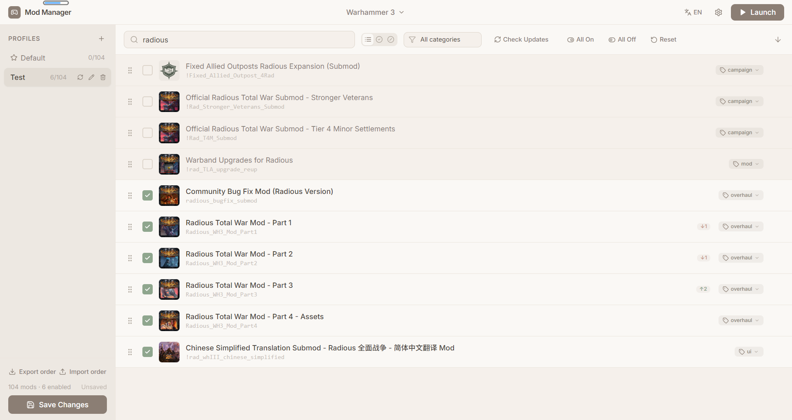

# Total War Mod Manager

[中文说明](./README.zh-CN.md)

A **personal-use** desktop mod manager for the **Total War** series. So far it has only been tested on **Windows 11** with **Warhammer III** — it works well enough for me. Other Total War titles have not been looked at yet.

This project was built entirely with **Cursor**. If you run into any issues, feel free to open an issue.

## Features

- ~~**Multi-game support** — Warhammer 2, Three Kingdoms, Troy, Pharaoh, Rome 2, Shogun 2, and more~~ **Warhammer III**
- **Profiles** — Create, rename, and switch mod presets; save changes explicitly
- **Load order** — Drag-and-drop sorting with overwrite / conflict hints
- **Workshop integration** — Dependency warnings, category tags, update checks
- **Launch game** — Writes `used_mods.txt` and starts the game executable
- **Export / import order** — Share profile load order as JSON (`<profile-name>.json`). If you and your friends want to use this mod manager together, it might come in handy — maybe
- **Unsaved changes guard** — Prompts before closing the app or launching with unsaved edits
- **Bilingual UI** — English and Chinese

## Screenshots



## Requirements

- **Node.js** 18+ and npm
- **Steam** with at least one supported Total War title installed
- **Windows** (primary target; Linux launch path exists in core)

## Getting Started

### 1. Install dependencies

```bash
cd core
npm install

cd ../desktop
npm install
```

### 2. Run in development

```bash
cd desktop
npm run dev
```

### 3. Build for production

```bash
cd core
npm run build

cd ../desktop
npm run build
```

## Project Structure

```
ttw_mod_manager/
├── core/          # Mod manager library + CLI
├── desktop/       # Electron desktop app (React UI)
└── docs/
    └── screenshots/   # Place README screenshots here
```

| Package | Description |
|---------|-------------|
| [`core/`](./core/) | Game discovery, mod scanning, presets, pack reading, launcher helpers, CLI |
| [`desktop/`](./desktop/) | GUI: mod list, profiles, settings, game launch |

See [`core/README.md`](./core/README.md) for CLI usage and library API.

## Supported Games

| ID | Game |
|----|------|
| `wh3` | Total War: Warhammer III |
| ~~`wh2`~~ | ~~Total War: Warhammer II~~ |
| ~~`threeKingdoms`~~ | ~~Total War: Three Kingdoms~~ |
| ~~`troy`~~ | ~~A Total War Saga: Troy~~ |
| ~~`pharaoh`~~ | ~~Total War: Pharaoh~~ |
| ~~`dynasties`~~ | ~~Total War: Pharaoh Dynasties~~ |
| ~~`attila`~~ | ~~Total War: Attila~~ |
| ~~`rome2`~~ | ~~Total War: Rome II~~ |
| ~~`shogun2`~~ | ~~Total War: Shogun 2~~ |

## License

MIT — see [`core/package.json`](./core/package.json).
